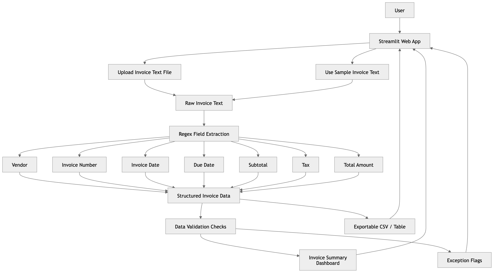
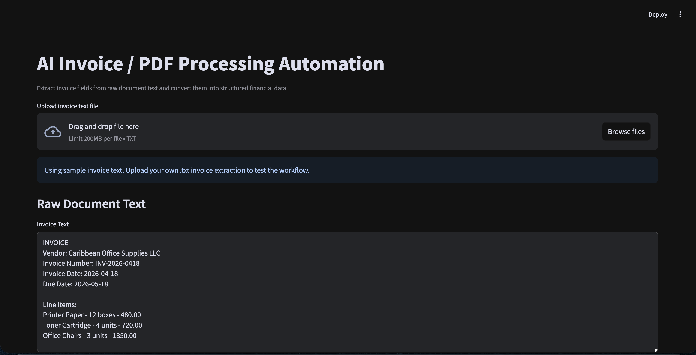
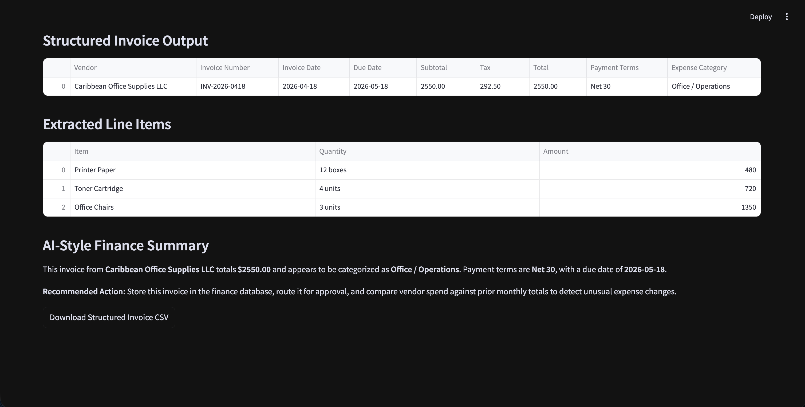
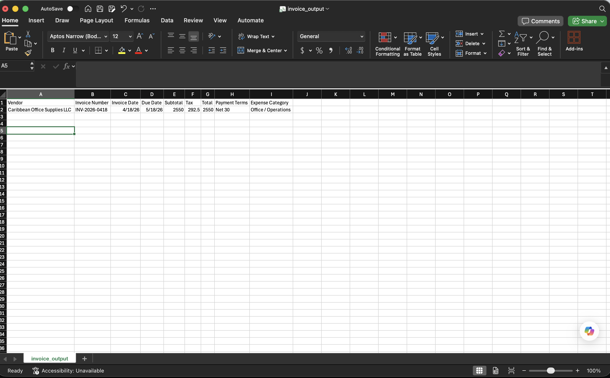

# AI Invoice / PDF Processing Automation

## Business Problem
Finance and operations teams waste time manually extracting invoice data from PDFs, receipts, and purchase orders.

## Solution
This demo extracts key invoice fields, classifies the expense, structures line items, and exports the result as clean financial data.

## Use Case Diagram


## What It Demonstrates
- Document automation
- Regex and AI-style information extraction
- Finance workflow automation
- Structured data export
- Practical business process improvement

## Invoice Dashboard







## Run
```bash
pip install -r requirements.txt
streamlit run app.py
```
